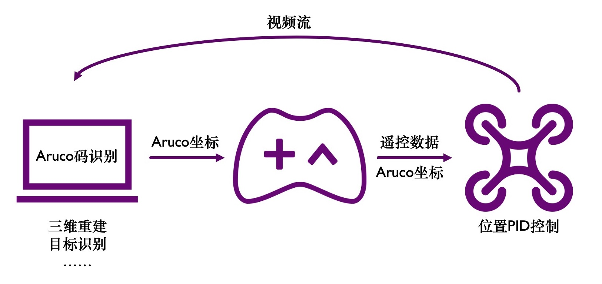
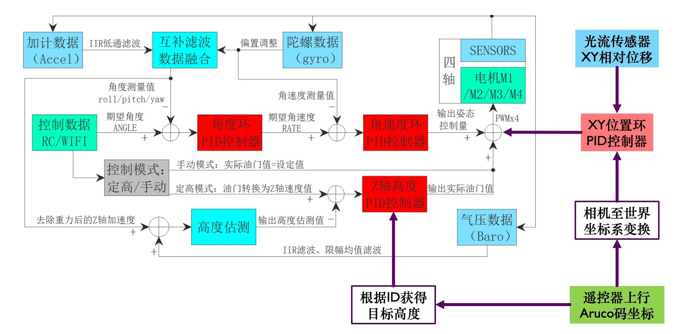

# Aruco tracking minifly drone

Course project for 现代电子系统设计 (Contemporary Electronic System Design), Department of Automation, Tsinghua University.

## Hardware

1. ATK-MiniFly basic kit
2. Optical flow module of Minifly
3. Wifi camera module of Minifly

## Task

1. Use detected Aruco id to determine the target height of the drone. The target height is `3 * aruco_id`.
   
   The id of aruco are 45, 35 and 25, thus the height are 135cm, 105cm and 75cm accordingly. Notice the ascent/descent of the drone when detecting the aruco.
2. Track the position of the detected aruco. (Hover over the detected aruco)
   
   After moving the drone rightwards using the remoter, the drone automatically returned directly above the aruco.

## System

The block diagram of our system:

Diagram of the drone:

